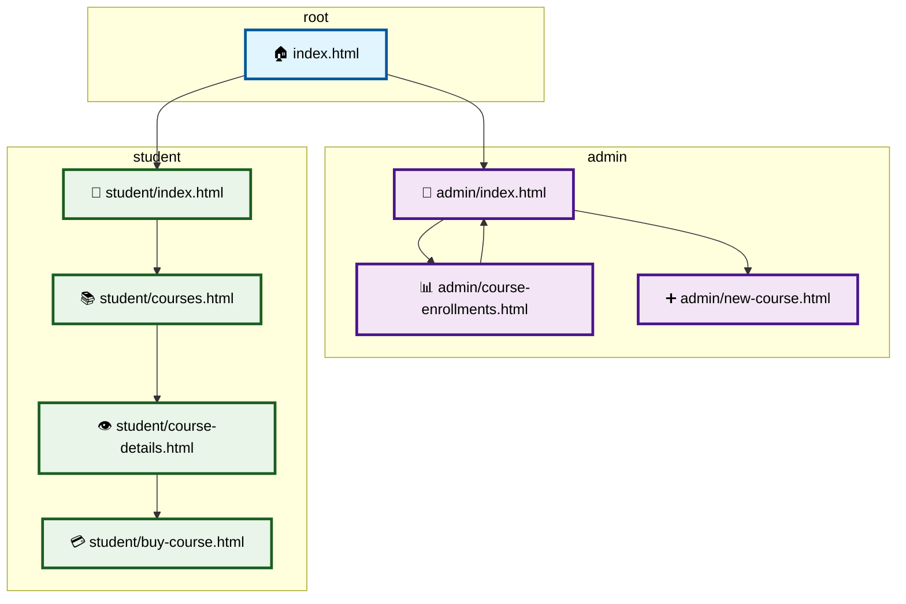

# westcoast-education
[](https://www.typescriptlang.org/)
[](https://github.com/typicode/json-server)
[](https://www.typescriptlang.org/)




## 🎓 Project Overview

**westcoast-education** is a vanilla TypeScript + HTML/CSS education platform with separate admin and student interfaces. Students can browse courses, view details, and purchase while admins manage courses and track enrollments.

## 🚀 Quick Start

### Frontend & Backend in one
```bash
# possibly first time: chmod +x ./start_server.sh
./start_server.sh
```

## 🏗️ Frontend File Structure

```
public/
├── index.html                 # Landing page
├── admin/
│   ├── index.html            # Admin dashboard, list of courses
│   ├── course-enrollments.html # Enrollment management
│   └── new-course.html       # Course creation
└── student/
    ├── index.html            # Student dashboard
    ├── courses.html          # Course catalog
    ├── course-details.html   # Course details
    └── buy-course.html       # Purchase flow
```

## ✨ Features

- **Dual Interface**: Separate admin & student experiences
- **TypeScript**: Type-safe frontend with `tsc` compilation
- **Vanilla TS/JS**: No frameworks (used `supabase cli` to generate db types)
- **Responsive**: Works on all screen sizes
- **Course Management**: Partial CRUD for courses, enrollments, purchases...
