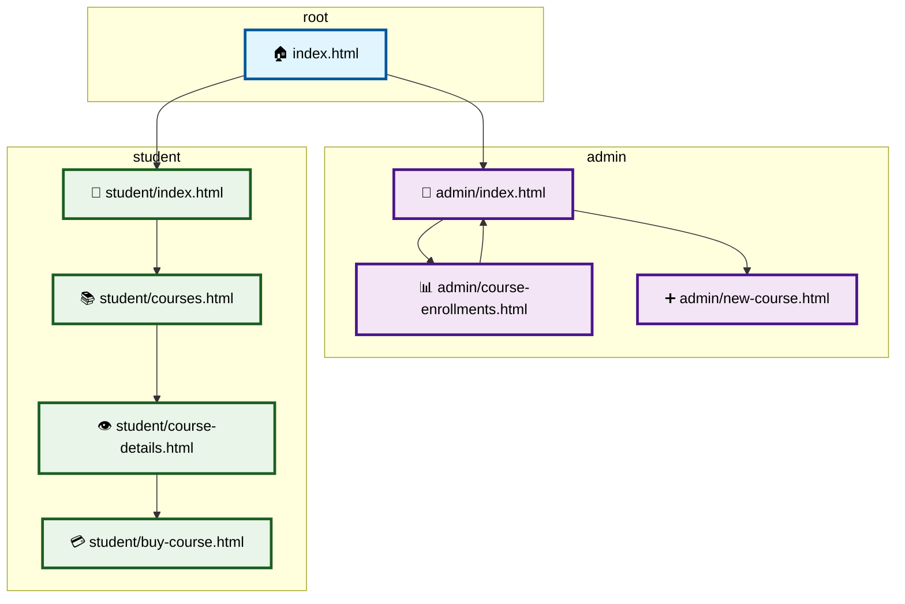

# westcoast-education

```mermaid

graph TD
    subgraph "root"
        index.html["🏠 index.html"]
    end
    
    subgraph "admin"
        admin/index["🔧 admin/index.html"]
        admin/enrollments["📊 admin/course-enrollments.html"]
        admin/newcourse["➕ admin/new-course.html"]
    end
    
    subgraph "student"
        student/index["👋 student/index.html"]
        student/courses["📚 student/courses.html"]
        student/details["👁️ student/course-details.html"]
        student/buy["💳 student/buy-course.html"]
    end
    
    index.html --> student/index
    student/index --> student/courses
    student/courses --> student/details
    student/details --> student/buy
    
    index.html --> admin/index
    admin/index --> admin/newcourse
    admin/index --> admin/enrollments
    admin/enrollments --> admin/index
    
    classDef root fill:#e1f5fe,stroke:#01579b,stroke-width:3px,color:#000
    classDef admin fill:#f3e5f5,stroke:#4a148c,stroke-width:3px,color:#000
    classDef student fill:#e8f5e8,stroke:#1b5e20,stroke-width:3px,color:#000
    
    class index.html root
    class admin/index,admin/enrollments,admin/newcourse admin
    class student/index,student/courses,student/details,student/buy student
```

test